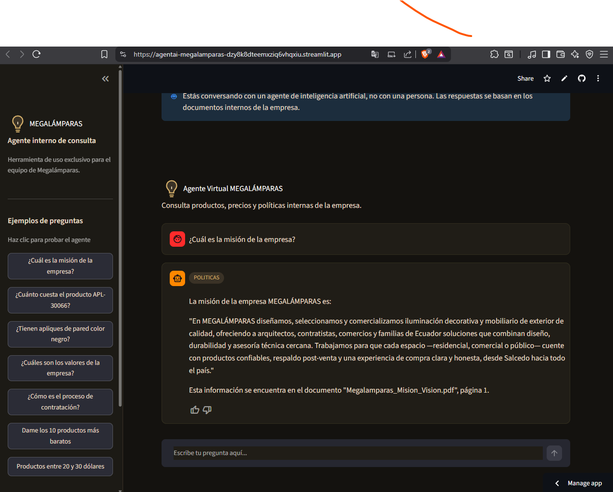

# 💡 Agente Alura — MEGALÁMPARAS

Agente de inteligencia artificial que permite a cualquier colaborador de **MEGALÁMPARAS** (iluminación decorativa y mobiliario de exterior, Salcedo, Ecuador) hacer preguntas en lenguaje natural sobre las políticas internas de la empresa y sobre el catálogo de productos/precios, sin necesidad de abrir manualmente ningún documento.

Proyecto desarrollado como desafío final del programa Alura/Oracle **"Agente Alura"**.

---

## 🔗 Demo en línea

**URL de la aplicación (Streamlit Community Cloud):**
👉 https://agentai-megalamparas-dzy8k8dteemxziq6vhqxiu.streamlit.app

> ⚠️ Nota sobre el despliegue: el desafío original sugiere OCI (Oracle Cloud Infrastructure) como plataforma de despliegue. Debido a limitaciones de acceso al proceso de verificación por tarjeta de crédito requerido para crear una cuenta en OCI, y con autorización expresa de la coordinación del programa, este proyecto fue desplegado en **Streamlit Community Cloud**, una alternativa gratuita y pública equivalente en cuanto a accesibilidad del servicio.

**Captura de la aplicación en producción:**



**Video de demostración:**

https://drive.google.com/file/d/1YivqwGHm7KiVQdYym60QXKtbBD14ztr7/view?usp=sharing

---

## 🧭 Descripción del proyecto

MEGALÁMPARAS cuenta con documentación interna dispersa en distintos formatos (PDF, Word, Excel): políticas de RRHH, reglamento interno, política de privacidad, y un catálogo de precios con más de 190 productos. Encontrar información específica implicaba abrir y revisar manualmente estos archivos.

Este agente resuelve ese problema combinando dos enfoques complementarios:

| Tipo de consulta | Fuente | Técnica |
|---|---|---|
| Políticas, misión, visión, valores, RRHH, contratos | PDF / Word | RAG (Retrieval-Augmented Generation) |
| Precios, productos, stock, catálogo | Excel | Búsqueda estructurada directa (pandas) |

Un **router** clasifica automáticamente cada pregunta y la dirige al flujo correcto, incluso cuando una sola pregunta combina ambos temas.

---

## 🏗️ Arquitectura

```
Usuario (interfaz Streamlit)
        │
        ▼
   router.py  ──► clasifica la pregunta con Cohere Command
        │
        ├── POLITICAS ──► buscar.py (embeddings + ChromaDB + rerank) ──► generar_respuesta.py
        │
        ├── PRODUCTOS ──► buscar_excel.py (pandas: texto, precio, orden) ──► generar_respuesta_excel.py
        │
        ├── AMBOS ──► separar_pregunta() ──► ambos flujos en paralelo, respuesta combinada
        │
        └── OTRO ──► respuesta fija (saludo / fuera de alcance)
```

### Pipeline de procesamiento de documentos (etapa 1)

1. **Extracción por formato**
   - PDF → `pypdf`, extracción por página, con detección automática de posibles páginas escaneadas (aviso de necesidad de OCR, no implementado en esta versión).
   - Word → `python-docx`, extracción por secciones usando los estilos de título (Heading) del documento.
   - Excel → `pandas` + `openpyxl`, lectura estructurada de la tabla de precios.
2. **Limpieza de texto**: eliminación de espacios repetidos, números de página sueltos, líneas vacías duplicadas, encabezados/pies de página repetidos en PDFs (detectados por frecuencia), y corrección heurística de títulos con letras espaciadas por diseño.
3. **Chunking**: `RecursiveCharacterTextSplitter` de LangChain (500 caracteres, 50 de solapamiento). Para PDFs, las páginas se unen en un solo texto continuo antes de cortar, evitando que contenido importante quede partido justo en el límite entre dos páginas.
4. **Metadatos por fragmento**: archivo de origen, categoría (carpeta), fecha de modificación, y ubicación exacta (página o sección).
5. **Contexto embebido**: cada fragmento incluye una cabecera (`Documento | Categoría | Ubicación`) antes de generar su embedding, mejorando la precisión de la búsqueda semántica.

### Etapa 2 — Agente de IA

- **Embeddings**: `embed-multilingual-v3.0` (Cohere).
- **Base vectorial**: ChromaDB (persistente en disco, métrica de similitud coseno).
- **Búsqueda**: recuperación de los 10 fragmentos más similares, luego **reranking** con `rerank-multilingual-v3.0` (Cohere) para quedarse con los 3 más relevantes.
- **Generación de respuesta**: `command-r-plus-08-2024` (Cohere), con instrucciones estrictas de no inventar información y citar la fuente documental exacta.
- **Búsqueda de productos**: motor propio sobre `pandas` que soporta:
  - Búsqueda por código exacto
  - Búsqueda por palabras clave en la descripción (con manejo de sinónimos genéricos como "lámpara")
  - Ordenamiento por precio (más barato / más caro)
  - Filtro por rango de precio ("entre X y Y", "menos de X")
  - Cantidad de resultados solicitada explícitamente por el usuario

### Etapa 3 — Interfaz y despliegue

- **Interfaz**: Streamlit, con diseño personalizado inspirado en la identidad visual de Megalámparas (paleta oscura con acentos dorados).
- Historial de conversación dentro de la sesión.
- Indicación explícita de que se trata de un agente de IA.
- Botón de retroalimentación (👍/👎) en cada respuesta.
- Categoría de la consulta visible (badge) para trazabilidad.
- Preguntas de ejemplo en la barra lateral, a modo de guía rápida.
- **Despliegue**: Streamlit Community Cloud, con generación automática de la base vectorial en el primer arranque del servidor (no se sube pre-generada al repositorio).

---

## 🛠️ Tecnologías utilizadas

- **Python 3**
- **LangChain** (`langchain-text-splitters`) — chunking de texto
- **Cohere** — embeddings, reranking y modelo de generación (Command R+)
- **ChromaDB** — base de datos vectorial
- **pandas / openpyxl** — lectura y consulta del catálogo de productos
- **pypdf** — extracción de texto de PDF
- **python-docx** — extracción de texto de Word
- **Streamlit** — interfaz web y despliegue

---

## 📁 Estructura del proyecto

```
Agente-MegaLamp/
├── app.py                     # Interfaz Streamlit (punto de entrada)
├── requirements.txt
├── .env                       # API key de Cohere (no se sube al repositorio)
├── .gitignore
├── Politicas-Negocio/         # Documentos fuente (PDF, Word, Excel)
│   ├── Estrategico/
│   ├── Legal/
│   ├── Operacional/
│   └── RRHH/
└── src/
    ├── leer_documento.py      # Extracción de PDF/Word/Excel
    ├── procesar_texto.py      # Limpieza y chunking
    ├── generar_embeddings.py  # Embeddings con Cohere
    ├── guardar_vectores.py    # Persistencia en ChromaDB
    ├── buscar.py               # Búsqueda semántica + rerank
    ├── generar_respuesta.py   # Respuesta RAG (políticas)
    ├── buscar_excel.py        # Búsqueda estructurada de productos
    ├── generar_respuesta_excel.py  # Respuesta sobre productos
    └── router.py               # Clasificación y orquestación
```

---

## ⚙️ Instrucciones para ejecutar el proyecto localmente

### 1. Clonar el repositorio

```bash
git clone https://github.com/thelifesf/AgentAI-Megalamparas.git
cd AgentAI-Megalamparas
```

### 2. Instalar dependencias

```bash
pip install -r requirements.txt
```

### 3. Configurar la API key de Cohere

Crear un archivo `.env` en la raíz del proyecto con el siguiente contenido:

```
COHERE_API_KEY=tu_api_key_de_cohere
```

Se puede obtener una key gratuita en [dashboard.cohere.com](https://dashboard.cohere.com/api-keys).

### 4. Ejecutar la aplicación

```bash
streamlit run app.py
```

La primera vez que se ejecuta, la aplicación procesa automáticamente los documentos de `Politicas-Negocio/` y genera la base vectorial (puede tardar 1-2 minutos). Las siguientes ejecuciones son inmediatas.

La aplicación se abrirá en `http://localhost:8501`.

---

## 💬 Ejemplos de preguntas y respuestas

**Pregunta:** ¿Cuál es la misión de la empresa?
**Respuesta:** La misión de MEGALÁMPARAS es diseñar, seleccionar y comercializar iluminación decorativa y mobiliario de exterior de calidad... *(respuesta completa citando el documento y página exacta)*

**Pregunta:** ¿Cuánto cuesta el producto APL-30066?
**Respuesta:** El producto APL-30066 (Aplique de pared Málaga, negro, 4W, 3000K) tiene un precio de $10.99.

**Pregunta:** ¿Tienen apliques de pared color negro entre 10 y 20 dólares?
**Respuesta:** Lista completa de los productos que cumplen ambos criterios (color y rango de precio), con código, descripción y precio exacto de cada uno.

**Pregunta:** ¿Cuáles son los valores de la empresa y cuánto cuesta el producto LAP-0007?
**Respuesta:** El sistema detecta que la pregunta combina dos temas, la separa automáticamente en dos sub-consultas independientes, y responde ambas partes por separado (valores institucionales + información del producto).

**Pregunta:** ¿Cuál es la capital de Ecuador?
**Respuesta:** El agente reconoce que la pregunta está fuera de su alcance (no relacionada con MEGALÁMPARAS) y lo indica claramente, sin intentar responder con información inventada.

---

## ⚠️ Limitaciones conocidas

- La extracción de texto desde PDF puede presentar espaciado irregular en títulos con diseño estilizado (letras separadas visualmente en el documento original); se aplicó una heurística de corrección que cubre la mayoría de los casos, sin ser 100% infalible.
- No se implementó OCR: si un PDF llegara a ser una imagen escaneada (sin texto seleccionable), el sistema lo detecta y emite un aviso, pero no extrae su contenido.
- La clasificación de preguntas que combinan **tres o más temas distintos** en una sola frase (en vez de dos) puede perder precisión, ya que el mecanismo de separación de consultas mixtas fue diseñado para dos partes.
- La búsqueda de productos por palabras clave depende de una lista de términos vacíos/genéricos que se ha ido ampliando durante las pruebas; nuevas formas coloquiales de preguntar pueden requerir ajustes futuros.
- El catálogo de precios se mantiene en memoria durante la sesión del servidor; una actualización del archivo Excel original requiere reiniciar la aplicación para reflejarse.

---

## 🔄 Mantenimiento y mejoras futuras propuestas

Como parte del diseño del proyecto, se identifican los siguientes procesos necesarios para mantener el agente confiable en producción a largo plazo (no implementados en esta versión por alcance del desafío):

- **Pipeline de actualización automática**: monitoreo periódico de la carpeta de documentos fuente para detectar archivos nuevos, modificados o eliminados, y reprocesar/reindexar automáticamente sin intervención manual.
- **Opción de carga de documentos desde la interfaz**: permitir que un colaborador autorizado suba nuevos archivos directamente desde la aplicación web.
- **Curaduría de contenido**: asignar un responsable por categoría (RRHH, Legal, Operacional) que revise periódicamente si los documentos indexados siguen vigentes.
- **Monitoreo de calidad**: seguimiento de tasa de preguntas sin respuesta, retroalimentación negativa (ya se captura la señal 👍/👎 en la interfaz, pendiente su almacenamiento y análisis) y tiempos de respuesta.
- **Evaluación periódica de nuevas versiones del modelo de lenguaje**, con pruebas previas antes de sustituir el modelo en producción.

---

## 👤 Autor

Proyecto desarrollado por Tonny como parte del desafío final "Agente Alura" (Alura/Oracle).

---

© 2026 Megalámparas — Grupo AP&P. Todos los derechos reservados.
*Este es un proyecto educativo desarrollado para la empresa Megalámparas como caso de uso real.*
